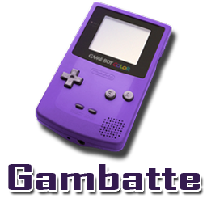

# Nintendo - Game Boy / Color (Gambatte)

### Description

Gambatte is an accuracy-focused, open-source, cross-platform Game Boy Color emulator written in C++.

### License

GPLv2

### Icon

### Fanart

Help make me fanart!

### Screenshots

### Disclaimer

*Game Boy and Game Boy Color are registered trademarks of Nintendo of America, Inc. Gambatte is not affiliated with or endorsed by any of the companies mentioned.*
